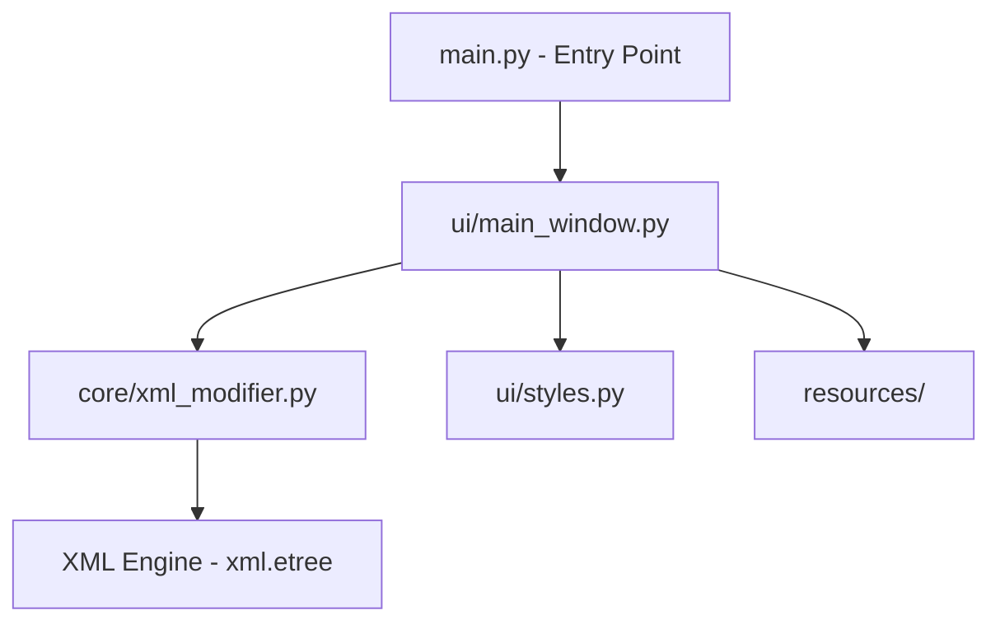

# Arquitectura del Sistema: XML Modifier Pro

Este documento describe la estructura técnica y las decisiones de diseño fundamentales que rigen la aplicación.

## 1. Visión General de la Estructura

El proyecto sigue un patrón de diseño desacoplado para separar la lógica de negocio de la interfaz de usuario:

## 2. Componentes Principales

### 2.1 Core (Motor XML)
Ubicado en `src/core/xml_modifier.py`, contiene funciones puras de Python para:
- **Parseo**: Lectura de archivos mediante `ElementTree`.
- **Modificación**: Soporta coincidencia exacta, Regex y la constante masiva `[TODOS]`.
- **Validación**: Asegura que los archivos procesados mantengan la integridad estructural XML.

### 2.2 UI (Interfaz de Usuario)
Desarrollada con **PyQt6**, se divide en:
- **`main_window.py`**: Gestiona el event-loop, la navegación por pestañas y el feedback visual.
- **`styles.py`**: Sistema de diseño basado en Apple Design Guidelines (macOS Look & Feel).

## 3. Patrones de Diseño Clave

### 3.1 Procesamiento Asincrónico (QThread)
Para evitar que la interfaz se bloquee al procesar grandes volúmenes de archivos, se implementó `ProcessingThread`. Esto permite:
- Mantener la GUI responsiva.
- Actualizar una barra de progreso en tiempo real mediante señales (`pyqtSignal`).

### 3.2 Filtrado Inteligente (Proxy Model)
En lugar de filtrar arrays manualmente, el `FilterableComboBox` utiliza un `QSortFilterProxyModel`. Esto proporciona:
- Búsqueda instantánea en listas de miles de tags.
- Manejo nativo de mayúsculas/minúsculas.
- Sincronización automática entre lo que el usuario escribe y la selección real.

## 4. Gestión de Recursos
La aplicación utiliza rutas dinámicas calculadas en tiempo de ejecución (`sys._MEIPASS`) para localizar iconos SVG, permitiendo que el software funcione tanto en modo desarrollo como empaquetado como un `.app` nativo de macOS.

---
*Documentación técnica generada para XML Modifier Pro v2.0*
